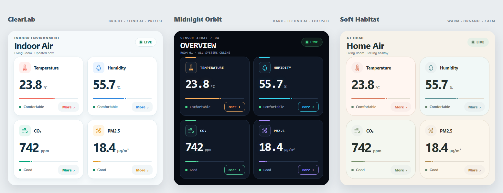
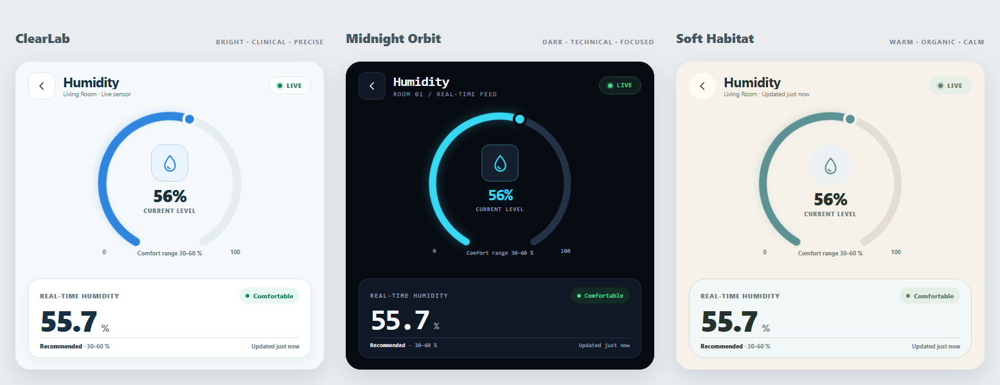
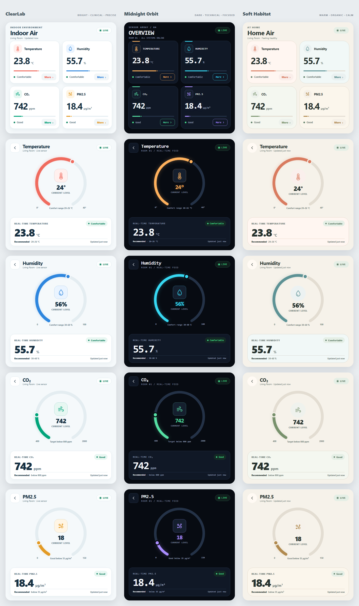

# 480 × 480 室内环境监测界面

这是一个面向 SquareLine Studio / LVGL 的室内环境监测界面设计项目，画布尺寸固定为 `480 × 480 px`。

项目包含三套风格不同但都保持简约的完整界面。每套方案均包括一个主页以及 Temperature、Humidity、CO₂、PM2.5 四个详情页，共计 15 个页面。

界面中的可见文案全部使用英文，README 与实现文档使用中文。

## 界面预览

### 三套主页



### 湿度详情页



### 全部 15 个页面



## 三种设计风格

### 1. ClearLab

明亮、理性、清晰的仪器风格。

- 浅色背景和白色卡片
- 数据层级清楚
- 指标颜色辨识度高
- 适合医疗设备、空气检测仪和白天使用

### 2. Midnight Orbit

深色、科技、专注的设备面板风格。

- 深蓝黑背景
- 细描边和高亮色圆弧
- 数字具有更强的仪表感
- 适合黑色外壳、夜间显示和科技产品

### 3. Soft Habitat

柔和、安静、偏家居产品的设计风格。

- 暖米白背景
- 大圆角和低饱和配色
- 视觉更加温和
- 适合智能家居、空气管家和消费级产品

## 功能与页面

主页使用 2 × 2 网格显示四项实时数据：

```text
Temperature  23.8 °C      Comfortable
Humidity     55.7 %       Comfortable
CO₂          742 ppm      Good
PM2.5        18.4 µg/m³   Good
```

每张卡片包含：

- 指标图标
- 指标名称
- 实时数值和单位
- 小型进度条
- 当前状态
- `More` 按钮

点击 `More` 可以进入对应指标的详情页，点击左上角返回按钮可以回到主页。

详情页包含：

- 不闭合圆弧进度条
- 随实时数值移动的圆点
- 指标图标
- 实时数值和单位
- Comfortable、Good 等状态
- 推荐范围
- 数据更新时间

湿度示例值为 `55.7%`，圆点会停留在整个有效圆弧约 `55.7%` 的位置。由于数值位于 `30–60%` 的舒适范围内，状态显示为 `Comfortable`。

## 快速查看

直接用浏览器打开：

```text
index.html
```

原型不需要服务器、构建工具或网络连接。HTML、CSS、SVG 和 JavaScript 均已包含在单个文件中。

默认页面会同时显示三套方案。所有 `More` 和返回按钮都可以点击。

## 项目结构

```text
.
├─ index.html
├─ README.md
├─ design-tokens.json
├─ squareline-implementation-guide.md
├─ assets/
│  ├─ README.md
│  ├─ icon-back.svg
│  ├─ icon-co2.svg
│  ├─ icon-humidity.svg
│  ├─ icon-pm25.svg
│  └─ icon-temperature.svg
└─ previews/
   ├─ preview-home-directions.png
   ├─ preview-humidity-details.png
   ├─ preview-all-screens.png
   └─ screens/
      ├─ clear-lab-*.png
      ├─ midnight-orbit-*.png
      └─ soft-habitat-*.png
```

## 文件说明

| 文件 | 说明 |
|---|---|
| `index.html` | 三套可交互界面原型 |
| `squareline-implementation-guide.md` | SquareLine/LVGL 坐标、Arc、字体、状态和交互实现规格 |
| `design-tokens.json` | 三套主题的颜色、布局和传感器参数 |
| `assets/` | 可编辑的单色 SVG 图标 |
| `previews/screens/` | 15 张独立的 `480 × 480` PNG 页面图 |
| `preview-all-screens.png` | 三套方案全部页面的总览图 |

## SquareLine 实现建议

可以选择两种页面组织方式：

### 五个 Screen

```text
Home
TemperatureDetail
HumidityDetail
CO2Detail
PM25Detail
```

这种方式直观，适合快速搭建。

### 两个 Screen

```text
Home
SensorDetail
```

四个指标共用一个详情页模板。点击 `More` 时动态替换标题、图标、颜色、数值、单位和量程，更节省 Flash 与 RAM。

圆弧建议设置：

- 有效角度：`300°`
- 底部缺口：`60°`
- Rotation：`120°`
- Track 与 Indicator 使用圆头
- Arc 仅用于显示，关闭 Clickable
- 使用 Arc Knob 或独立圆形对象表示实时位置

详细坐标、颜色和状态规则请查看：

```text
squareline-implementation-guide.md
```

## 字体与单位

字体资源需要包含以下字符：

```text
° ₂ µ ³ –
```

如果目标固件不支持这些字符，可以使用：

```text
CO2
ug/m3
```

## 兼容性

- 画布：`480 × 480 px`
- 推荐平台：SquareLine Studio、LVGL 8/9
- 原型浏览器：Chrome、Edge、Firefox
- 所有预览页面均已检查为精确的 `480 × 480 px`
