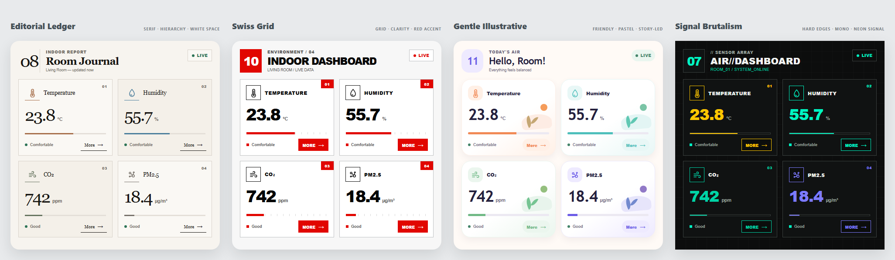
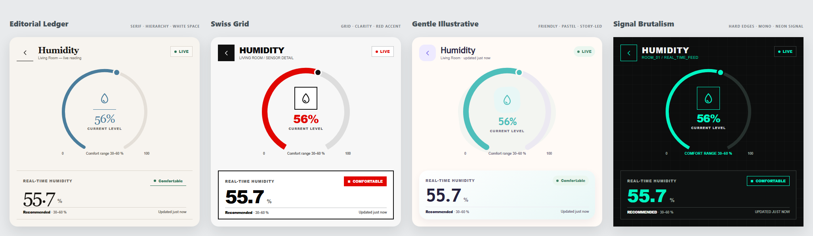
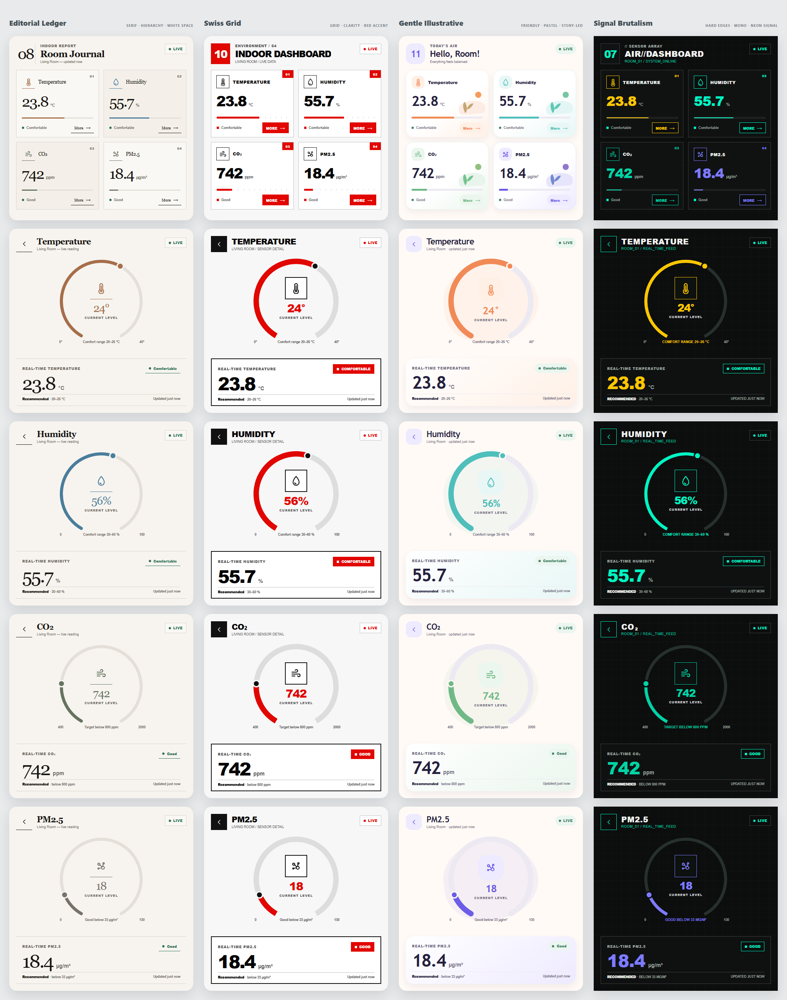

# 480 × 480 室内环境监测界面：参考风格第二版

本目录包含根据四张风格参考图重新设计的室内环境监测界面。

四套视觉方向分别为：

1. Editorial Ledger：编辑排版风格
2. Swiss Grid：瑞士国际主义风格
3. Gentle Illustrative：柔和插画风格
4. Signal Brutalism：野蛮主义科技风格

每套方案均包含：

- 1 个主页
- Temperature 详情页
- Humidity 详情页
- CO₂ 详情页
- PM2.5 详情页

共计 `4 × 5 = 20` 个页面，所有页面尺寸均为 `480 × 480 px`，界面中的可见文案全部使用英文。

## 主页对比



## 湿度详情页对比



## 全部页面



## 四套风格

### Editorial Ledger

- 大字号衬线字体
- 黑白与低饱和指标色
- 细分隔线、留白和杂志排版层级
- 卡片不使用圆角和阴影
- 推荐字体：Playfair Display、Georgia

### Swiss Grid

- 严格的二维网格
- 黑、白、红高对比配色
- 粗体无衬线字体
- 直角边框和明确的编号系统
- 推荐字体：Helvetica Neue、Montserrat

### Gentle Illustrative

- 柔和米白背景
- 紫色、橙色、绿色和青色的低饱和组合
- 圆角卡片和简单几何插画
- 插画仅由圆形、叶片和色块组成，便于 SquareLine 实现
- 推荐字体：Nunito Sans、Montserrat

### Signal Brutalism

- 黑色背景和硬边框
- 荧光绿、黄色和紫色信号色
- 大写字母、编号和终端式提示
- 无圆角、无阴影
- 推荐字体：Roboto Condensed、Montserrat

## 查看方法

直接使用浏览器打开：

```text
index.html
```

页面无需服务器或外部依赖。每个 `More` 和返回按钮都可以点击。

## 文件结构

```text
reference-styles-v2/
├─ index.html
├─ README.md
├─ design-tokens.json
├─ squareline-implementation-guide.md
└─ previews/
   ├─ preview-home-directions.png
   ├─ preview-humidity-details.png
   ├─ preview-all-screens.png
   └─ screens/
      ├─ editorial-*.png
      ├─ swiss-*.png
      ├─ illustrative-*.png
      └─ brutal-*.png
```

`previews/screens/` 中包含 20 张独立的 `480 × 480` PNG，可在 SquareLine 搭建时逐屏对照。
